# 📜 Mantiq (منطق) - Smart Collaborative Notes

> **The name "Mantiq" (Logic)** is inspired by the great Arab Muslim scholars who were masters of logic and knowledge. Just as they carefully recorded and shared wisdom, this app is a modern tool for your thoughts, powered by Artificial Intelligence.

## 📖 About The Project

**Mantiq** is a full-stack note-taking app that does more than just save text. It bridges the gap between a simple notebook and a smart workspace.

I built this project to demonstrate advanced skills in the **MERN Stack** (MongoDB, Express, React, Node.js). It goes beyond the basics to include **Real-Time Collaboration** and **Generative AI**, creating a place where you can write freely and get help instantly.

## 🌟 Why This App?

We believe in a **User-First** approach. While building this app, we focused heavily on User Experience (UX) to ensure your data is safe and your experience is seamless.

*   **Safety Net:** Accidental deletion happens. That's why we included a **Trash** system with a recovery timer.
*   **Freedom:** You can export your data anytime in multiple formats.
*   **Privacy:** You can deactivate your account if you need a break, with a grace period to change your mind.

## ✨ Features

This application comes packed with essential tools and powerful modern features.

### ✅ Core Features
*   **🔐 Secure Login:** 
    *   Sign Up and Login easily using **Google** or **GitHub**.
    *   Your notes are private and secure using industry-standard authentication.
*   **📝 Note Management:** 
    *   **Create, Edit, Delete:** Full control over your notes.
    *   **Rich Text Editor:** Write beautifully with headings, lists, bold text, code blocks, and more using a notion-style editor.
*   **❤️ Favorites & Pins:**
    *   Mark your most loved notes as **Favorite** to find them quickly.
    *   **Pin** important notes to the top of your dashboard for instant access.
*   **🤝 Smart Sharing & Collaboration:**
    *   **Share via Link:** Generate a unique link to share your note with anyone.
    *   **Permissions:** You decide who makes changes. distinct access levels like **Read-Only** (view only) or **Edit** (full collaboration).
    *   **Conflict-Free Editing:** When multiple people edit at once, we use **Socket.io** and **CRDTs (Yjs)** to merge changes intelligently. No data is ever lost or overwritten.
*   **📊 Activity Logging:** 
    *   The app logs important events to help developers find and fix errors quickly, ensuring a stable experience.
*   **🛡️ Error Handling:** 
    *   If something goes wrong, the app shows a helpful message instead of crashing, keeping you in control.
*   **🧪 Reliable Testing:** 
    *   The code is tested automatically (using **Vitest**) to make sure everything works effectively before any update.
*   **🔍 Code Quality:** 
    *   Checked by **SonarQube** to ensure the code is clean, maintainable, and follows best practices.
*   **🗄️ Smart Database:** 
    *   Organized storage for Users, Notes, and Shared Sessions using **MongoDB**, designed for scale.

### 🚀 Advanced Features (The "Mantiq" Edge)
*   **🤖 AI Assistant (Gemini):** 
    *   Stuck on a sentence? Ask the AI to **write for you**, **summarize notes**, **fix grammar**, or **give you ideas** right inside the editor.
*   **🤝 Real-Time Collaboration:** 
    *   Work together! Multiple users can edit the same note at the same time. You can see each other's typing and cursors instantly.
*   **📤 Export Options:** 
    *   Need to share your work offline? Download your notes in these formats:
        *   **PDF:** Good for printing.
        *   **Markdown (.md):** Good for developers.
        *   **HTML:** Good for the web.
        *   **DOCX:** Good for Word documents.
*   **🗑️ Trash & Recovery:**
    *   Deleted notes aren't gone forever immediately. They move to the **Trash**.
    *   You have **30 Days** to restore them before they are permanently deleted. A countdown timer shows you exactly how much time is left.
*   **🚦 Account Management:**
    *   **Deactivate Account:** Need a break? You can deactivate your account.
    *   **30-Day Recovery:** Reactivate your account simply by logging in within 30 days.
    *   **Support Ticket:** After 30 days, you can submit a ticket to our customer support to request manual reactivation.
*   **📌 Organization:** 
    *   **Pin Notes:** Keep important notes at the top.
    *   **Categories:** Group your notes so you can find them easily.
*   **⚡ Modern Design:** 
    *   Fast and looks good on any screen size.
    *   **Smart Greeting:** The dashboard welcomes you based on the time of day.

---

## 🛠️ Technology Stack

### Frontend (Client-Side)
*   **React.js (v18+):** The library for building the user interface.
*   **TypeScript:** Ensures type safety and reduces runtime errors.
*   **Vite:** Next-generation frontend tooling for instant server start.
*   **Tailwind CSS & Shadcn UI:** For a cohesive, modern design system.
*   **Zustand:** A small, fast, and scalable state management solution.
*   **BlockNote:** A notion-style block-based rich text editor engine.
*   **React Query:** Powerful data synchronization for server state.

### Backend (Server-Side)
*   **Node.js & Express:** The runtime and framework powering the API.
*   **MongoDB & Mongoose:** NoSQL database for flexible and scalable data storage.
*   **Socket.io & Yjs (CRDT):** The real-time engine enabling collaborative editing and conflict resolution.
*   **Google Gemini AI:** The Large Language Model (LLM) powering the AI features.
*   **Auth.js:** Handles secure authentication strategies.
*   **Pino:** For structured, low-overhead logging.

### Quality Assurance & DevOps
*   **Vitest:** Blazing fast unit testing framework.
*   **SonarQube:** Continuous inspection of code quality.

---

## ⚙️ Environment Setup

To run Mantiq locally, you simply need to configure the environment variables.

### 1. Backend Configuration (`backend/.env`)
Create a file named `.env` inside the `backend/` folder and add the following keys:

| Variable | Description & Example |
| :--- | :--- |
| `PORT` | Port for the backend server (e.g., `4000`) |
| `DB_URI` | MongoDB Connection String (e.g., `mongodb+srv://...`) |
| `AUTH_SECRET` | Random string for session encryption (e.g., `your-secret-key`) |
| `AUTH_GOOGLE_ID` | Google OAuth Client ID (from Google Cloud Console) |
| `AUTH_GOOGLE_SECRET` | Google OAuth Client Secret (from Google Cloud Console) |
| `GEMINI_API_KEY` | Google Gemini AI API Key (from Google AI Studio) |
| `FRONTEND_URL` | URL of your frontend (e.g., `http://localhost:5173`) |
| `NODE_ENV` | Set to `development` for local use |
| `SERVICE_EMAIL` | The sender address for automated system emails (Nodemailer) (e.g., `bot.mantiq@gmail.com`) |
| `SERVICE_EMAIL_PASSWORD` | 16-character App Password for the sender email (e.g., `xxxx xxxx xxxx xxxx`) |
| `ADMIN_EMAIL` | The recipient email for contact form submissions (e.g., `your.email@gmail.com`) |

> **💡 Important:** The `SERVICE_EMAIL_PASSWORD` is **NOT** your regular Gmail password. It is a generated **App Password** that allows the app to send emails securely without disabling 2-Step Verification. You can generate one in your Google Account Security settings.

### 2. Frontend Configuration (`frontend/notes-app/.env`)
Create a file named `.env` inside the `frontend/notes-app/` folder and add the following keys:

| Variable | Description & Example |
| :--- | :--- |
| `VITE_API_URL` | URL of your backend API (e.g., `http://localhost:4000`) |
| `VITE_APP_URL` | URL of your frontend app (e.g., `http://localhost:5173`) |

---

## 🚀 Installation & Run Guide

Follow these steps to get the project up and running on your local machine.

### 1. Clone the Repository
```bash
git clone https://github.com/OyeeeTalha/talha-yaseen-mern-10pshine.git
cd talha-yaseen-mern-10pshine
```

### 2. Setup Backend
```bash
cd backend
npm install        # Install backend dependencies
# (Ensure your .env file is created as per the instructions above)
npm run dev        # Start the development server
```
*The backend server will start on http://localhost:4000*

### 3. Setup Frontend
Open a new terminal window:
```bash
cd frontend/notes-app
npm install        # Install frontend dependencies
# (Ensure your .env file is created as per the instructions above)
npm run dev        # Start the client application
```
*The application will launch in your browser at http://localhost:5173*

---

## 📸 Visual Tour

Experience the flow of Mantiq through these screens.

### 1. Landing Page
*The gateway to your new intellectual workspace.*
<!-- TODO: Add screenshot of Landing Page here -->
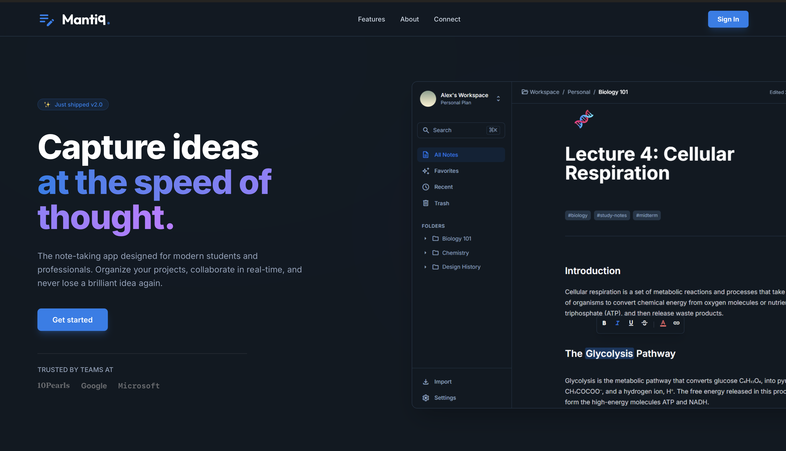

### 2. Secure Authentication
*Easy and secure sign-in options.*
<!-- TODO: Add screenshot of Sign In Page here -->
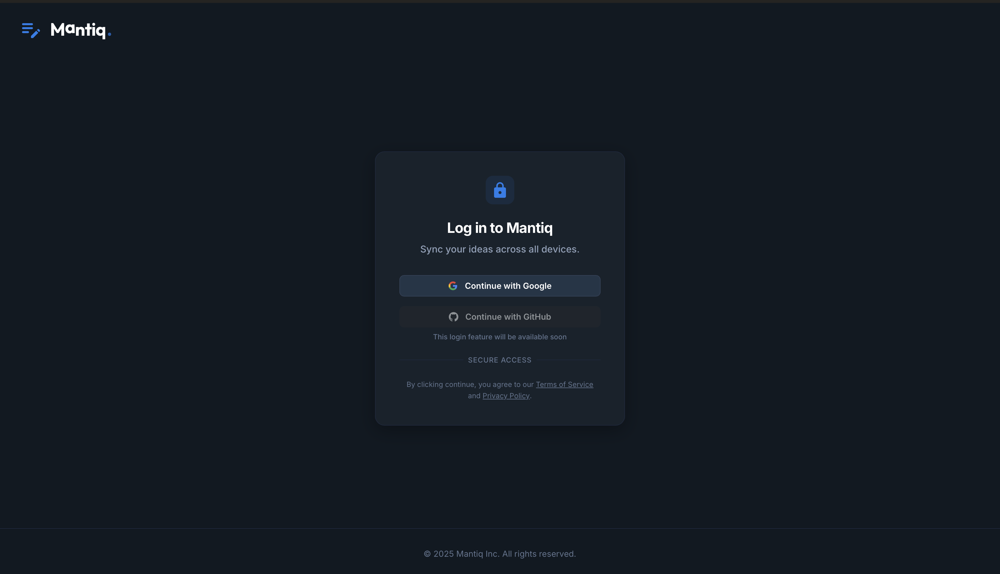

### 3. Dashboard
*Your central hub for all notes, pinned items, and categories.*
<!-- TODO: Add screenshot of Dashboard here -->
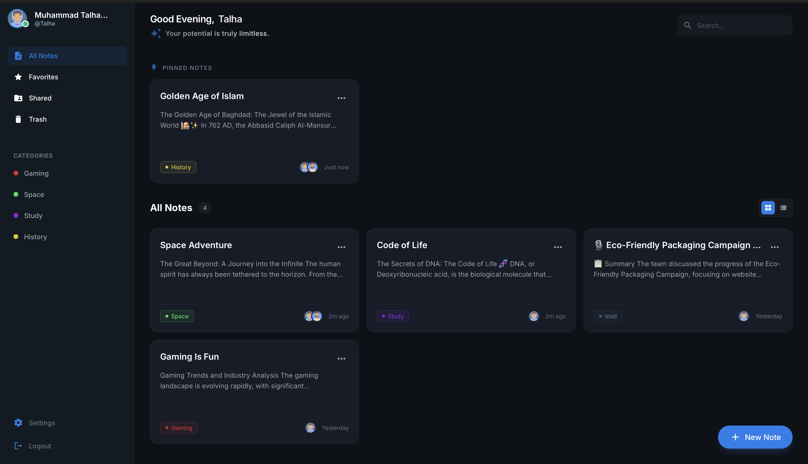

### 4. Intelligent Editor
*A distraction-free writing environment with AI powers.*
<!-- TODO: Add screenshot of Note Editor here -->
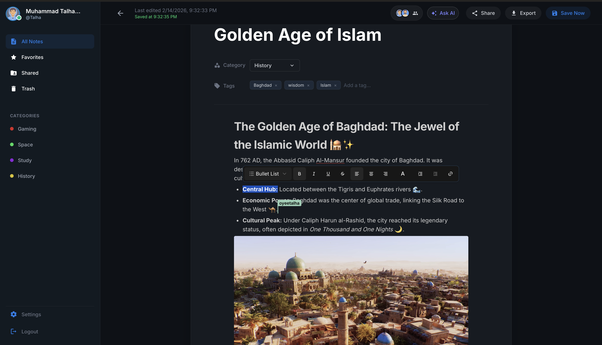

### 5. Shared Public View
*How your work looks when shared with the world.*
<!-- TODO: Add screenshot of Shared Note Page here -->


### 6. Trash & Recovery
*Safe deletion with a 30-day recovery window.*
<!-- TODO: Add screenshot of Trash/Recycle Bin here -->
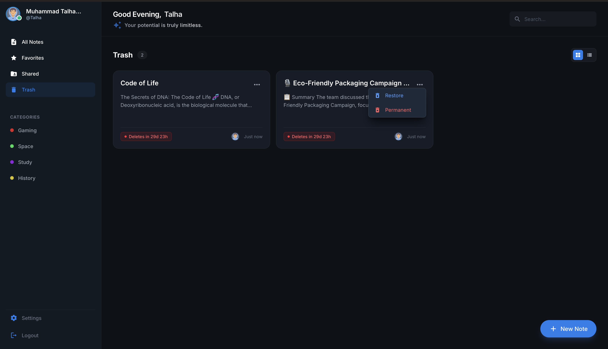

### 7. Account Deactivation
*User-controlled privacy with a grace period.*
<!-- TODO: Add screenshot of Deactivation Modal/Screen here -->
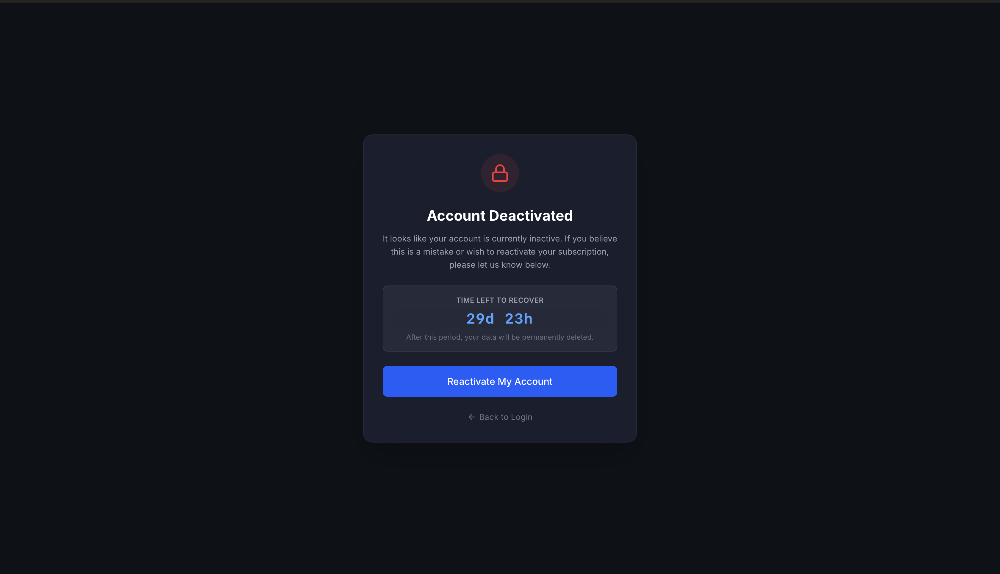

### 8. Reactivation Request
*Easy recovery flow if you change your mind.*
<!-- TODO: Add screenshot of Reactivation Request Screen here -->
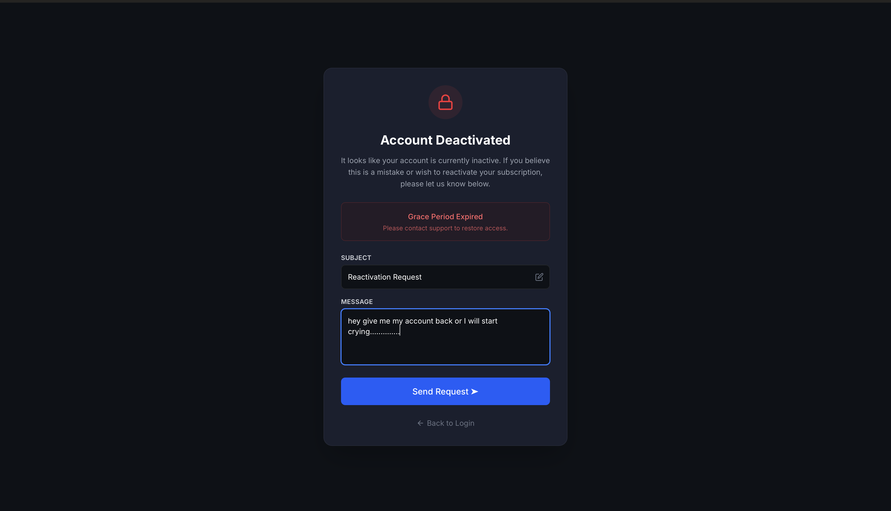

### 9. Ask AI Assistant
*Get instant help with drafting, summarizing, and editing.*
<!-- TODO: Add screenshot of Ask AI Modal here -->
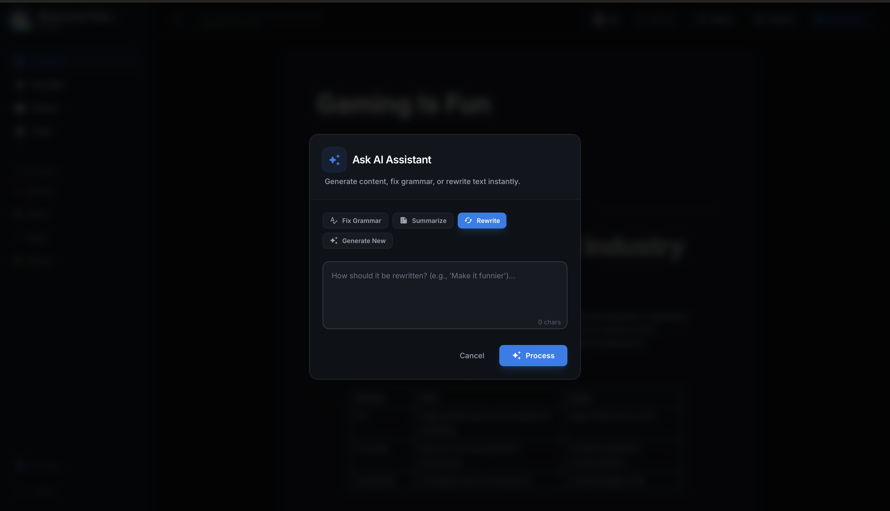

### 10. AI Diff View
*Review and accept AI suggestions with a clear difference view.*
<!-- TODO: Add screenshot of AI Diff View here -->
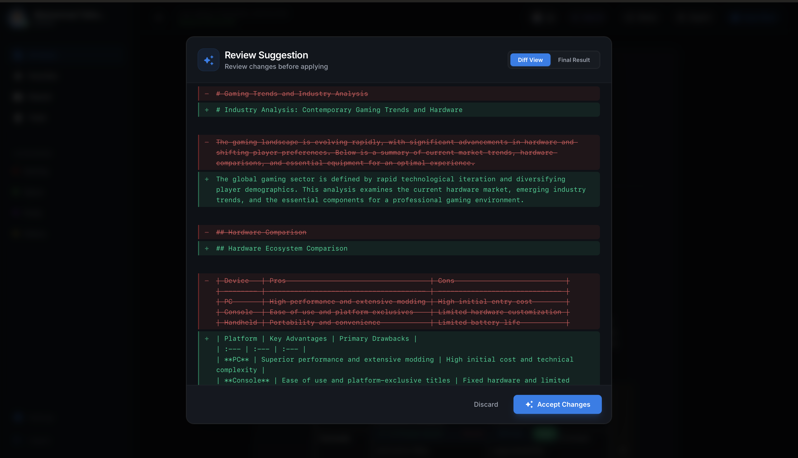

### 11. Profile Page
*Manage your account settings and preferences.*
<!-- TODO: Add screenshot of Profile Page here -->
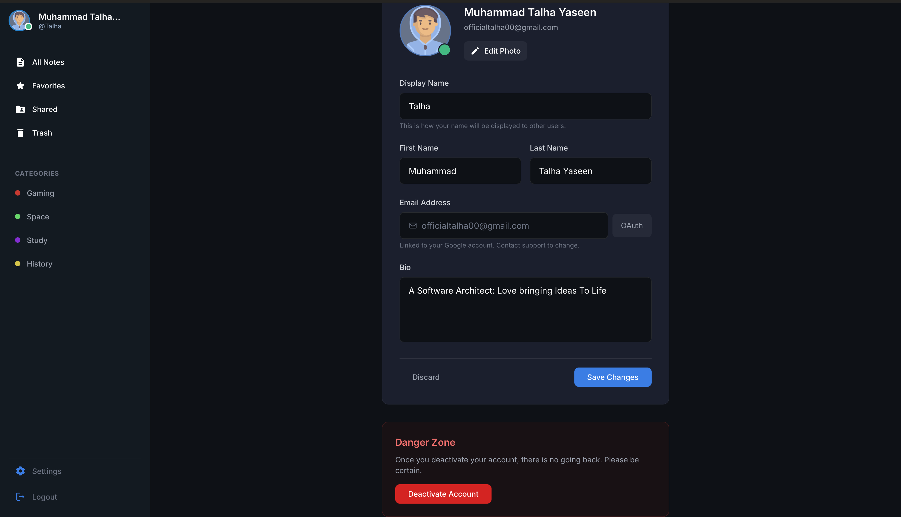

---

## 🧪 Testing & Code Quality

We use **Vitest** for rigorous testing and **SonarQube** for continuous code inspection.

### 1. Backend Tests
<!-- TODO: Add screenshot of Backend Test Results here -->
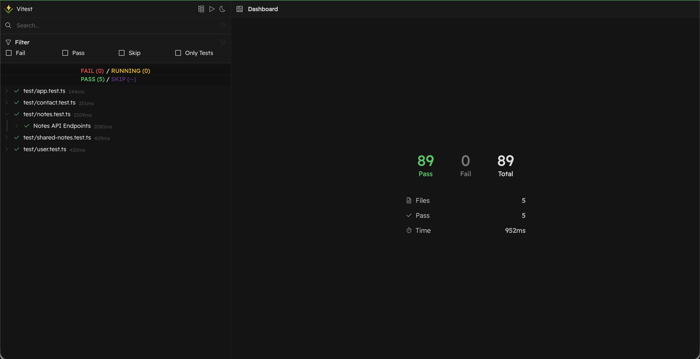

```bash
cd backend
npm test
```

### 2. Frontend Tests
<!-- TODO: Add screenshot of Frontend Test Results here -->
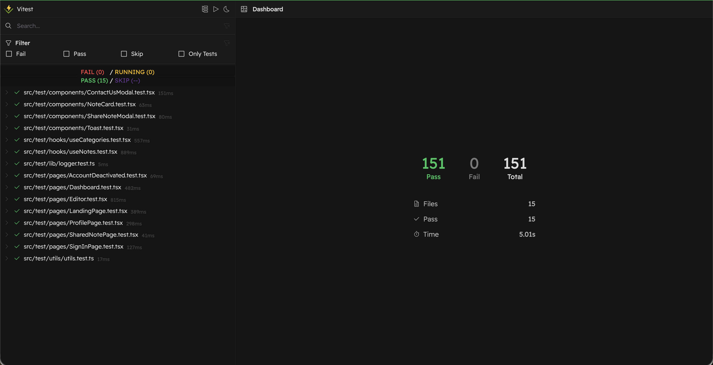

```bash
cd frontend/notes-app
npm test
```

### 3. SonarQube Analysis
<!-- TODO: Add screenshot of SonarQube Report here -->
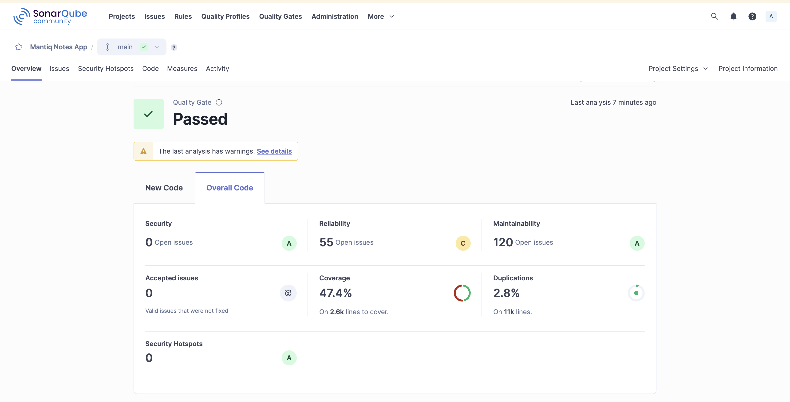

---

*Designed & Developed by Muhammad Talha Yaseen*
